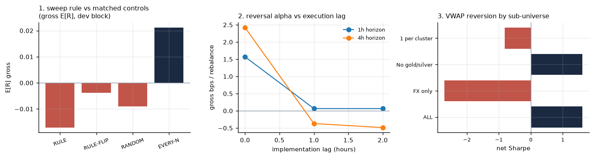

# Research log

A chronological record of what was tried, what it showed, and what was decided.
Every number is reproducible from the scripts named in each section. Nothing was
removed because it was inconvenient.

---

## Step 0 — Audit the data before trusting it

`run_data_audit.py`

The `*_15m_real.parquet` files are not pure 15-minute series. 142 of 156 begin with
a block of daily (37) or hourly (105) bars carrying 15m filenames — 3 % of rows but
**60 % of the calendar span**. The first 4,863 rows of `EURUSD_15m_real.parquet` are
byte-identical to `EURUSD_d1_real.parquet`.

**Decision:** clip every series at its detected resolution boundary. Usable 15m
history is 2023-09 → 2026-09 for ~66 instruments and 2024-07 → 2026-09 for the rest.
Full detail in [DATA_INTEGRITY.md](DATA_INTEGRITY.md).

The second finding from this step shaped everything after it: the `spread` column
is populated and usable, and it reveals that **retail ECN commission alone is ~14 %
of one 15-minute ATR on EURUSD**. On this universe, cost is not a detail to be
bolted on at the end; it is the dominant term.

---

## Step 1 — Build the primary rule and measure it in-sample

`research/dev_search.py` — 31 configurations, dev block 2023-09-15 → 2024-06-30

Coordinate-wise search over polarity, take-profit multiple, ratchet design, sweep
geometry, holding horizon and stop floor.

**Every single configuration was negative.** Best: −0.100 R per trade, t = −3.83.
Fade and continuation polarities both lost. Mean modelled cost was 0.08–0.15 R per
trade, so the rule's *gross* expectancy was roughly −0.02 R — a coin flip, with
costs doing the damage.

---

## Step 2 — Control experiments: is the rule better than nothing?

`research/diagnostics.py`

A losing backtest means nothing without knowing what the same machinery does on
inputs that cannot contain alpha. Four buckets, identical exits and identical costs:

| bucket | n | E[R] net | E[R] gross | t(gross) |
|---|---:|---:|---:|---:|
| RULE | 1,443 | −0.1002 | −0.0171 | −0.66 |
| RULE-FLIP (same events, side reversed) | 1,443 | −0.0905 | −0.0038 | −0.14 |
| RANDOM (matched session mix) | 1,492 | −0.1037 | −0.0090 | −0.34 |
| EVERY-N (systematic, in-session) | 1,494 | −0.0733 | +0.0212 | +0.81 |

**RULE − RANDOM = −0.0038 R, t = −0.11.**

The liquidity-sweep event is statistically indistinguishable from a random entry.
So is its mirror image. Three further facts emerged:

- bar-discretised triple barriers are **not a fair game even on a random walk** —
  the pessimistic within-bar tie-break, gap-through-at-open fills and the weekend
  flatten together cost ~0.01–0.02 R. Any strategy using these barriers must be
  judged against that baseline, not against zero;
- costs are ~0.08–0.16 R per round turn, i.e. 4–10× the size of any gross effect
  found anywhere in this study;
- NAS100 15m log returns have AC(1) = **−0.14**, far outside what a liquid market
  should show — a flag for non-synchronous CFD quoting that mattered later.

**Decision:** stop tuning the rule. Go and find out what this universe *does*
support.

---

## Step 3 — Cost-aware alpha screen

`research/alpha_screen.py` — 100 signal × horizon combinations, dev block only

Candidate families: short-horizon reversal, time-series and cross-sectional
momentum, Donchian breakout, RSI/VWAP/prior-day-range reversion, volume and
volatility state. Evaluated as dollar-neutral decile long/short books, scored in
basis points net of the modelled round-turn cost.

Top results looked spectacular — cross-sectional short-horizon reversal at
`net Sharpe 4–8`, with Spearman ICs at t = 6–19.

Also informative: `donch_24h` had IC = **−0.044** (t = −7.9) and `mom_24h` IC =
−0.032. At 1h–1d horizons this universe **mean-reverts**, which is a coherent
reason why an ICT-style continuation rule would fail.

---

## Step 4 — Try to kill the reversal signal (successfully)

`research/reversal_robustness.py`

A 4–8 Sharpe is not a discovery, it is a bug report. Five tests:

| test | result |
|---|---|
| **implementation lag** | gross edge 1.57 bps at lag 0 → **0.065 bps at lag 1 hour**. A 96 % collapse. |
| sub-universe | all negative after the lag |
| stale-quote filters | no material change |
| cost stress | already negative at 1× |
| sub-period | negative in both halves |

**The entire effect lived in the same close that generated the signal** — the
signature of bid-ask bounce and non-synchronous quoting, not a tradable anomaly.
This is also the likely source of NAS100's −0.14 autocorrelation.

**Decision:** every subsequent evaluation carries a mandatory 1-bar execution lag.

---

## Step 5 — Re-screen with the lag built in

`research/lagged_screen.py` — 80 combinations

Of 80, exactly **5** cleared `net Sharpe > 0.5` with positive Sharpe in both halves
of the dev block. Four were the same momentum signal at two horizons. The standout:

> `vwap_rev @ 4h` — fade the deviation of price from its own 12-hour VWAP,
> cross-sectionally, rebalanced every 4 hours. Net Sharpe 3.93, halves 4.30 / 4.11.

Its anchor is a 48-bar average, so unlike the 1–2 bar reversal it is not just the
last tick. Worth a hostile look.

---

## Step 6 — Try to kill the VWAP signal (also successfully)

`research/vwap_robustness.py`

| test | result |
|---|---:|
| all 33 instruments, lag 1 | net Sharpe **+1.61** |
| **FX only** | **−2.70** |
| **one name per correlation cluster** | **−0.81** |
| **cluster-neutralised** | **−0.98** |
| cost × 1.5 | **−0.04** |
| cost × 2.0 | −1.66 |
| lag sensitivity (1, 2, 4, 8 h) | 1.61, 3.62, 3.20, 5.18 — non-monotonic |
| anchor × rebalance grid | −0.90 to +4.00, no stable plateau |

Three independent kills:

1. **It is not a per-asset effect.** Remove the ability to trade correlated
   instruments against each other — one name per cluster, or neutralise the cluster
   mean — and the Sharpe goes negative. The book was "mean-reverting" XAUUSD against
   XAUEUR, which is the EURUSD leg wearing a gold costume.
2. **No cost margin.** It dies at 1.5× costs. Market impact alone would exceed that.
3. **No parameter plateau and no monotone lag decay.** A real signal decays smoothly
   as you delay execution. This one went *up*. That is noise.

---

## Step 7 — Build the strategy properly anyway, and report what happens

`run_s5_strategy.py`

The frozen rule from Step 1 was taken out-of-sample (2024-07-01 → 2026-09-22) with
the full stack: purged/embargoed walk-forward meta-labelling, concurrency-capped
portfolio, Deflated Sharpe against the 31 trials.

| | primary rule | + ML gate |
|---|---:|---:|
| net R / trade | −0.1221 (t = −8.88) | −0.0492 (t = −1.43) |
| Sharpe | −5.13 | −0.75 |
| max DD | −87.0 % | −6.6 % |

And, re-running the matched control on the OOS window:

> **RULE − CONTROL = −0.064 R gross, t = −3.30.**

Out-of-sample the rule is not merely edgeless, it is significantly *worse* than a
random entry with the same barriers and costs.

The one genuinely positive result in the whole study: the meta-model **ranks**.
Spearman(prob, realised net R) = **+0.090** out-of-sample, mean net R rising from
−0.132 R in the bottom decile to −0.003 R in the top. It recovers essentially the
whole deficit — and has nothing left over, because the rule starts 0.12 R down.

---

## Step 8 — Audit the reference strategy

`run_s4_audit.py` → [S4_AUDIT.md](S4_AUDIT.md)

`s4_fvg_ml_strategy.py` reports +921.30 % ROI and +1,441 R. Keeping its own
features, its own labels, its own model and its own trade selection, and correcting
only the accounting:

| | total R |
|---|---:|
| as reported | +1,441.0 |
| booking the realised R it already computed | **−183.3** |
| + real costs, cost-viable instruments | −202.7 |
| + genuine 15m bars only | −987.0 |
| + one account with concurrency caps | −77.2 % return, Sharpe −4.46 |

The single line `trade_r = np.where(y_sub == 1, 2.0, -1.0)` discards a careful path
simulation and books every winner at +2 R regardless of size. S4's winners actually
average +0.673 R.

**Its true result, −183 R, agrees with this study's independent finding** that the
sweep family has no edge. The idea was never wrong *and* never tested.

---

## Standing conclusions

1. **No tradable intraday edge was found in this universe** at 15m–4h horizons that
   survives an execution lag, a cluster-neutrality check and a 1.5× cost stress.
   Three independent lines of attack — a rule, a 100-config screen, and an 80-config
   lagged re-screen — converged on the same answer.
2. **Cost is the binding constraint, not signal quality.** At 15m, round-turn cost
   is 8–15 % of R. The same signal quality at a multi-day horizon would clear it.
   Horizon is the highest-leverage variable available, and it was not explored here
   because the data only supports ~550 daily observations.
3. **The matched random control should be a gate, not a diagnostic.** It would have
   terminated this investigation in twenty minutes, and it would have caught S4's
   result immediately.
4. **Same-bar execution is the single most common way to manufacture a 4+ Sharpe.**
   One hour of lag removed 96 % of the strongest effect in the screen.
5. **Correlated-instrument universes manufacture fake breadth.** Eight gold crosses
   are one bet. Cluster-neutralisation turned a +1.6 Sharpe into −1.0.
