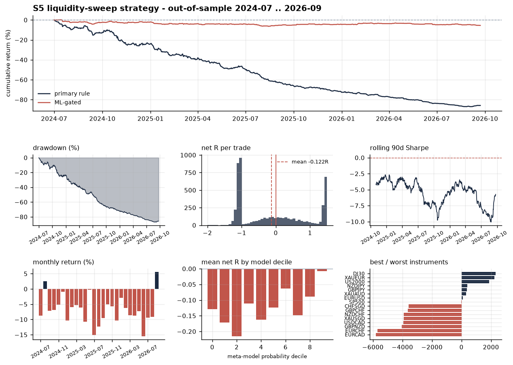

# S5 — Liquidity-Sweep Meta-Labelled Strategy

Runner: `.venv/bin/python run_s5_strategy.py`
Artefacts: [`reports/s5_tearsheet.png`](../reports/s5_tearsheet.png),
[`reports/s5_results.json`](../reports/s5_results.json)



---

## TL;DR

The strategy was built, frozen on a development block, and run out-of-sample.
**It loses money, and the research says it should.** The honest headline:

| | primary rule | + ML gate |
|---|---:|---:|
| OOS window | 2024-07-01 → 2026-09-22 | same |
| trades | 5,236 | 772 |
| net R / trade | **−0.1221** | **−0.0492** |
| t-stat on R | −8.88 | −1.43 |
| total return | −85.8 % | −5.5 % |
| Sharpe | −5.13 | −0.75 |
| max drawdown | −87.0 % | −6.6 % |
| profit factor | 0.773 | 0.900 |
| Deflated Sharpe | 0.000 | 0.001 |
| Sharpe 95 % CI | [−6.59, −3.70] | [−1.90, +0.47] |

Two things are worth more than the headline:

1. **The sweep rule is significantly *worse* than a random entry.** Against a
   matched control — random entry bars, same session mix, same barriers, same
   costs — the rule underperforms by **−0.064 R gross, t = −3.30**. It is not
   noise around zero; the event carries *negative* information for the fade
   direction over this period.
2. **The meta-model works, on a rule that does not.** Spearman correlation
   between the model's out-of-sample probability and realised net R is
   **+0.090**, and mean net R rises monotonically-ish from −0.132 R in the
   bottom decile to **−0.003 R in the top decile**. The ML layer recovers
   almost exactly the deficit — it just has nothing left over, because the base
   rule starts 0.12 R under water.

---

## 1. Economic hypothesis

Osler (2003, *Journal of Finance* 58:5), using a large FX dealer's actual order
book, documents that stop-loss orders cluster just **beyond** round numbers and
recent price extremes, while take-profit orders cluster **at** round numbers.
That predicts a specific, falsifiable microstructure pattern: price reaches a
known liquidity pool, triggers a cascade of resting stops, overshoots, and then
either

- **reverts**, as the cascade exhausts into resting limit interest — the
  stop-run reversion or "turtle soup" case; or
- **continues**, because the stops were fuel for genuine repricing.

Which of the two occurs should depend on observable state — how deep the raid
went, how fast price came back, where in the session it happened, what the
volatility regime is. That conditional structure is exactly what a meta-label
model is for, and it is why S5 emits *events with geometry* rather than a
hard-coded directional opinion.

This is the same family as the reference `s4_fvg_ml_strategy.py` (4H trend +
daily sweep + 15m FVG), deliberately: it lets the two be compared on equal terms.

## 2. Primary rule

Liquidity pools, all strictly causal:

| code | pool |
|---|---|
| `PD` | previous completed day's high / low |
| `AS` | current day's Asian-session (00:00–06:00 UTC) high / low, visible from 06:00 |
| `PW` | previous completed week's high / low |
| `SW` | rolling 48-bar (12 h) swing extreme, shifted one bar |

A **sweep event** fires on bar *t* when, inside the London/NY window (06:00–17:00 UTC):

1. the bar's extreme pierces a pool that was intact for the previous 6 bars,
2. penetration depth is in `[0.20, 1.50] × ATR(14)` — deep enough to be a raid,
   shallow enough not to be a repricing,
3. the close returns **inside** the pool with `close_pos ≥ 0.70` of the bar range
   (the reclaim).

Side = fade the sweep. Entry = **open of bar t+1**. Stop = sweep extreme ± 0.25 ATR,
floored at 1.5 ATR and capped at 4.0 ATR. Barriers: take profit at 1.5 R, time stop
at 16 bars (4 h), forced flat before the weekend.

### The stop floor is a cost decision, not a chart decision

On this dataset, retail ECN commission alone (0.70 bp round turn) is ~14 % of one
15-minute ATR on EURUSD. At a 1.0-ATR stop that is ~0.14 R of friction before any
slippage. The floor exists to push R far enough out that the strategy is not
competing with its own commission. At the frozen 2.5-ATR floor selected by the dev
search, median cost is **0.127 R** across the universe.

## 3. Universe construction

88 candidates (FX + metals + indices, after removing energy, duplicate contracts
`GER30/GAUUSD/GAUCNH`, and pegged crosses `USDHKD/EURHKD/GBPHKD/USDTHB`) → three
screens → **46 instruments in 20 correlation clusters**:

| screen | rule | effect |
|---|---|---|
| integrity | ≥ 20,000 genuine 15m bars after the padded block is clipped | see [DATA_INTEGRITY.md](DATA_INTEGRITY.md) |
| cost | modelled round-turn cost ≤ 0.22 R at an assumed 1.5-ATR stop | drops EURHUF, LEAD, NICKEL, CHINAH, XPTUSD, … |
| redundancy | average-linkage clustering on daily-return correlation, cut at ρ = 0.70 | the 8 gold crosses become one cluster, capped at 2 concurrent positions |

Full table: [`reports/universe_screen.csv`](../reports/universe_screen.csv).

## 4. Cost model

Taken from the dataset's own per-bar `spread` column (integer broker points ×
manifest `point`), not assumed:

```
round-turn cost = spread × (1 + 0.25 entry slip + 0.75 stop slip) + commission
```

Commission is 0.70 bp round turn on FX (raw-spread ECN, ~$3.5/lot/side) and 0 on
index/metal CFDs, where the wider quoted spread already carries it. Where the
broker wrote `spread = 0`, the instrument's own hour-of-day median is substituted.

Barrier **touch** detection runs on the quoted (bid) series and all friction is
charged once per round turn. The residual approximation — short-side barrier timing
is optimistic by about one spread — is under 2 % of R on the screened universe.

## 5. Labels and validation

- **Triple barrier** with gap-aware fills: a bar that gaps through the stop fills
  at that bar's **open**, not the stop level; if both barriers are inside one bar
  the **stop** is assumed to fill first.
- **Sample weights** = average uniqueness (overlapping holding periods down-weighted,
  AFML ch. 4) × exponential time decay (365-day half-life).
- **Anchored, purged, embargoed walk-forward**: refit every 60 days; training labels
  whose holding period reaches into the test fold are dropped, plus a 64-bar embargo.
  14 folds fitted over the OOS window.
- **Model**: equal-weight average of LightGBM + XGBoost + L2 logistic regression.
  Deliberately *not* a stacked blender fitted on in-sample base predictions — that
  is defect 6 in [the S4 audit](S4_AUDIT.md).
- **Gate learned in-fold**: the probability threshold is the 55th percentile of the
  *training* predictions, never of the test predictions.

## 6. Portfolio engine

A list of per-signal R-multiples is not a portfolio. The engine enforces max 8
concurrent positions, 1 per instrument, 2 per correlation cluster, 0.30 % of
*current* equity at risk per trade, probability-scaled sizing with a hard cap, and
a 2 % daily-loss circuit breaker — on a single \$100,000 compounding account. Over
the OOS window, concurrency caps rejected 513 of the primary rule's signals
(mostly `max_cluster`), which is the point: ten correlated gold signals in one hour
are one bet.

## 7. Honest accounting of the search

Everything tunable was tuned on **2023-09-15 → 2024-06-30 only**, with the bar
series itself truncated at the boundary so no path simulation could run past it.
The search was **coordinate-wise, 31 configurations** (`reports/dev_search_trials.csv`),
precisely so the trial count going into the Deflated Sharpe Ratio means something.
Result: `SR₀ = 1.37` annualised — i.e. after 31 trials you would expect a Sharpe of
1.37 from pure luck, so nothing below that is evidence of anything. S5's OOS Sharpe
is negative, and DSR ≈ 0.

**Every configuration was negative in-sample too.** The dev search did not find a
winner and then watch it fail out-of-sample; it never found a winner. The best of
31 configs was −0.100 R per trade with t = −3.83. That is reported rather than
hidden because the alternative — searching until something looked good — is how
+921 % backtests get written.

## 8. What the result actually tells you

**The meta-labelling thesis is supported; the alpha is not.** The secondary model
genuinely ranks trades it has never seen (Spearman +0.090 OOS, and a clean spread
from −0.13 R to −0.00 R across deciles). Its top features are informative about
*what it learned*:

```
vol_expansion, rng_atr, sweep_wick, pen_atr, tickvol_z,
body_frac, minute_of_day, d_atr_pctile, cost_to_r_est, roc64_atr
```

`minute_of_day` and `cost_to_r_est` ranking that highly means a large part of what
the model discovered is **when trading is structurally expensive**, not when the
sweep predicts direction. It is a cost-avoidance model wearing an alpha model's
clothes. That is a real and reusable finding: given a primary rule with any genuine
edge, this layer should add to it.

**The sweep event itself is not a signal.** Against the matched random control it is
0.064 R *worse*, with t = −3.30. The broader research programme
([RESEARCH_LOG.md](RESEARCH_LOG.md)) reached the same verdict from a second
direction: a 100-configuration cost-aware alpha screen over the same universe
produced exactly one candidate that survived an execution lag, and that one turned
out to be a cross-cluster artefact that died at 1.5× costs.

## 9. What I would do next

1. **Change horizon, not parameters.** Round-turn cost is ~0.13 R at 15m but would
   be ~0.02 R at a daily holding period. Every intraday idea on this universe is
   fighting a 13 % handicap per round turn; the same signal quality at a 5-day
   horizon would clear it comfortably.
2. **Keep the meta-label layer, replace the primary rule.** The layer demonstrably
   ranks. Point it at a rule with positive gross expectancy.
3. **Get the missing data.** Interest-rate differentials would make FX carry
   testable; an economic calendar would let event risk be excluded rather than
   absorbed. Neither is in this repository.
4. **Treat the control experiment as a gate, not a diagnostic.** No rule should
   reach the modelling stage until it beats its matched random control. That single
   check would have ended this investigation in twenty minutes.
