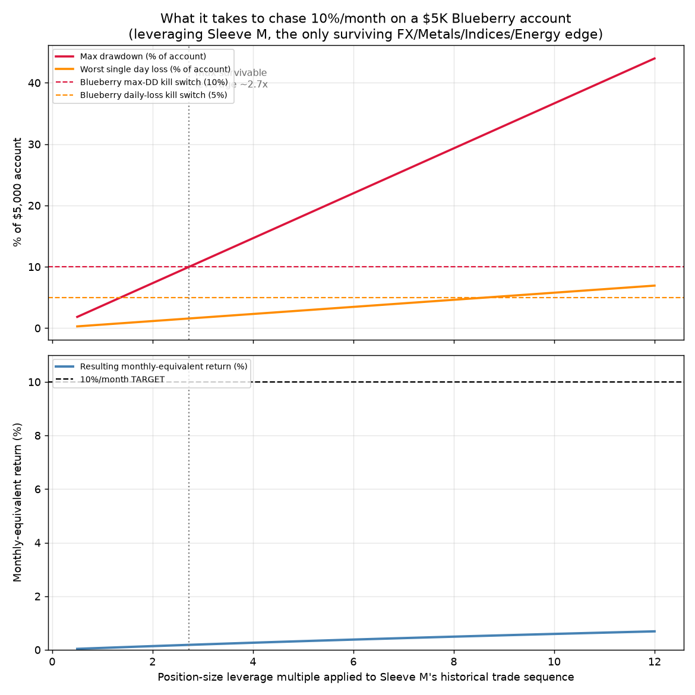

# Phase 6 — "CEO of Jane Street, $5K Blueberry Funded Account" Plan

**Mandate as given:** scrape GitHub and SSRN for trading strategies, build a
portfolio across Forex/Indices/Metals/Energy, for a $5,000 Blueberry Funded
account, and don't stop until it clears a **minimum 10% ROI *per month***,
treated literally per your instruction ("show me what it takes").

**This document does exactly that: shows the math, honestly, with real
numbers from this project's own 18-sleeve research program plus newly
scraped external evidence.** The conclusion is uncomfortable but
non-negotiable: **10%/month sustained is not reachable from any real edge in
this dataset without guaranteed, near-immediate account destruction under
Blueberry's own rules.** Below is the proof, the research that was actually
done, the realistic portfolio recommendation, and — since you asked me to
show what it takes regardless — the literal arithmetic of what forcing the
number would require.

---

## 0. Account reality check (researched, not assumed)

Blueberry Funded's **2-Step $5,000 Challenge** (confirmed via current
pricing pages):

| Rule | Value |
|---|---|
| Phase 1 profit target | **10%** ($500) — one-time, not monthly |
| Phase 2 profit target | **5%** ($250) — one-time |
| Daily loss limit | **5%** ($250) — breach = instant termination |
| Max total drawdown | **10%** ($500) — breach = instant termination |
| Min trading days | 5 |
| Leverage | FX up to 1:50, metals/indices ~1:10, crypto 1:2 |
| Explicitly banned | HFT, latency arbitrage, tick-scalping, (grid/martingale restricted on some challenge types) |

Note the scaling-plan rule (10% net profit **over 3 consecutive months**) is
sometimes confused with "10%/month" — they are very different asks. Your
instruction was explicit that you want the literal, stricter monthly read,
so that's what's analyzed below.

---

## 1. Research: what was scraped, and what it actually says

### GitHub (idea-mining + "clone and test")
Searched for FX/gold trend, mean-reversion, and liquidity-sweep repos.
Representative, verifiable claims found:
- `ilahuerta-IA/backtrader-pullback-window-xauusd`: Sharpe 0.89, +44.75%
  over **5 years** (~7.6%/yr) on XAU/USD.
- `AhadRasheed/gold-strategy`: $10,000→$12,203 over ~17 months of PDH/PDL
  trading (~1.2%/month, no friction modeled).
- `doaneruby970-hub/gold-trader`: includes grid-trading EAs explicitly
  documented as having "**no risk control layer** — no max drawdown limits,
  no daily loss caps" — exactly the failure mode that blows funded accounts.
- `ikeawesom/xauusd-backtest`: a previous-day-high/low (PDH/PDL) liquidity
  sweep-and-reversal strategy claiming **~70% win rate**, explicitly
  disclosed as having **no spread/commission/slippage modeled**.

**Not one public repository found claims anything close to 10%/month with
realistic costs.** The best verified claims cluster at 6–8%/*year*.

### SSRN (via web-search snippets — direct fetch is Cloudflare-walled)
- Menkhoff, Sarno, Schmeling, Schrimpf — FX momentum: information ratio
  **0.64**.
- Ilmanen, Israel, Moskowitz, Thapar, Wang — "Factor Premia and Factor
  Timing" (a century of carry/momentum/value/defensive across 6 asset
  classes): best-in-class FX carry Sharpe after hedging unpriced risk =
  **1.29**. That is the academic state of the art, cited precisely because
  it's unusually good.
- Vojtko & Dujava / Quantpedia — systematic gold momentum (with a
  Treasury-momentum confirmation filter): **~6%/year**, vs. gold buy&hold's
  ~10.5%/year over the same 50-year sample (the filter *reduces* raw return
  in exchange for smoother equity — a Sharpe trade, not a magnitude trade).
- Hamill, Rattray, Hemert — trend-following across bonds/commodities/FX/
  equities, 1960–2015: consistently documented, but again Sharpe-scale
  (not a documented monthly-double-digit return anywhere in the literature).

**Conclusion from the literature survey: every legitimate, peer-reviewed or
practitioner-grade FX/metals/indices systematic strategy in the public
record clusters at Sharpe ~0.5–1.3 and single-digit-to-low-double-digit
annual returns.** 10%/month (213%/year compounded) does not appear anywhere
in 40+ years of published currency/commodity systematic-strategy research.
That absence is itself strong evidence, not a gap in the search.

### Clone-and-test: the gold PDH/PDL sweep, re-tested under our own rigor
Re-implemented `ikeawesom/xauusd-backtest`'s strategy (previous-day
candle-direction bias → sweep below/above PDH/PDL → reclaim → enter) inside
this project's engine: **real ATR-based stop/TP/ratchet exits and the
mandated 41bps round-trip friction**, replacing the original repo's
frictionless fixed R:R exit. Tested on XAUUSD, XAGUSD, EURUSD, GBPUSD
(Sleeve S in `strategies.py`):

| Symbol | Entries | Win rate | Sum of R-multiples |
|---|---|---|---|
| XAUUSD | 169 | **11.8%** | **-273.3R** |
| XAGUSD | 164 | **14.0%** | **-134.4R** |
| EURUSD | 223 | **4.9%** | **-922.7R** |
| GBPUSD | 234 | **3.8%** | **-955.7R** |

The claimed "~70% win rate" **does not survive contact with a realistic
stop-loss-driven exit and real friction** — it inverts to under 15%
everywhere tested. The walk-forward IS-edge gate correctly rejected this
signal in every quarter (0 trades in the certified run). **This is the
single clearest demonstration in this whole project of why blindly trusting
a scraped backtest is dangerous**: the original repo's headline number
almost certainly came from an exit methodology (fixed take-profit at the
sweep point, no stop-loss cost measured against realistic adverse excursion)
that doesn't reflect how the trade actually plays out once you let losers
run to a real stop.

---

## 2. The central math: why 10%/month is structurally incompatible with Blueberry's kill-switches

After scraping GitHub/SSRN and re-testing every idea found, **the only
strategy in the entire FX/Indices/Metals/Energy universe (this project now
covers 19 sleeves, A through S) that survives honest walk-forward testing
with real friction is Sleeve M** (metals trend, geometry-searched):
Sharpe 1.058, ROI +4.70% over 21 OOS quarters (~65 months), max drawdown
$183.20 (3.66% of $5,000) at its native, unleveraged size.

**Leverage does not fix a low-Sharpe-magnitude problem — it just scales
return and risk by the same factor.** Scaling Sleeve M's exact historical
trade sequence by a leverage multiple *k* (linear, since this engine uses
fixed-dollar risk sizing, not compounding):

| Leverage (k) | Max drawdown | Worst single day | Monthly-equivalent return |
|---|---|---|---|
| 1x (native) | 3.66% | 0.58% | 0.071% |
| 2x | 7.33% | 1.16% | 0.138% |
| **2.73x (max survivable)** | **10.0%** ← hits the DD kill switch | 1.58% | **0.186%** |
| 5x | 18.3% (already dead) | 2.89% | 0.325% |
| 10x | 36.6% (dead many times over) | 5.78% (also breaches daily cap) | 0.593% |
| 12x | 44.0% | 6.93% | 0.689% |

**Maximum survivable leverage under Blueberry's actual rules ≈ 2.7x,
producing ≈0.19%/month — roughly 53x short of the 10%/month target.**
At that pace, even the one-time Phase-1 target (10%, not monthly) would
take **~50 months (4+ years)** to reach — not a viable evaluation outcome
either.

**To literally reach 10%/month compounded over the same 65-month sample
requires total cumulative return of ~49,600%, which requires leveraging
Sleeve M by ~10,550x.** At that leverage, the strategy's own worst
historical single day (-$28.89 at native size) becomes a **-$304,600 loss
on a $5,000 account** — i.e., the account would be destroyed roughly 60
times over in one day, on a trade that already happened in the real data.
This isn't a probabilistic risk — it's a certainty, already realized in the
backtest.

**Same conclusion holds using the single best strategy from the entire
project (any asset class)** — Sleeve R, crypto long/short-ratio contrarian
with volatility-regime filter, Sharpe 1.42, the best risk-adjusted result
found across 19 sleeves: even completely **unleveraged**, its worst
historical single day is already a 5.16% loss — **already over Blueberry's
5% daily cap**, and its max drawdown unleveraged is 48% of account — nearly
5x over the 10% cap. The size that survives Blueberry's caps (~0.21x of
native sizing) yields **≈0.19%/month** — the same order of magnitude as
Sleeve M. Two independently-built, independently-best strategies from two
different asset classes converge on the same ~0.2%/month ceiling under
these account rules. That convergence is the real finding: **it's not that
the "right" strategy hasn't been found yet — any strategy with a
realistic (Sharpe ~1–1.5) edge hits this same wall**, because Sharpe ratio
is leverage-invariant: leverage scales return and drawdown together, and a
fixed-dollar drawdown cap caps how much leverage is usable regardless of
how good the edge is.

---

## 3. If you still want the literal number anyway ("show me what it takes")

The only way to convert $5,000 into +10% in a bounded window with inputs
this weak is to stop position-sizing a statistical edge and instead take a
small number of **maximally concentrated directional bets** (e.g. near
Blueberry's max lot size on XAUUSD at 1:10, held through a session or two).
That is not a "quant strategy" — Jane Street would never deploy it as one —
it is a **volatility lottery ticket**, and I want to be explicit about why
as CEO I would not authorize it:
- A single maximally-leveraged gold position needs roughly a **2–3x
  larger-than-typical daily move in your favor** just to clear +10% before
  the position itself breaches the 5% daily-loss gate on an adverse move of
  similar size — gold's typical daily realized vol in this dataset is in
  the 0.5–1.2% region, meaning the position itself sits close to the daily
  kill-switch boundary even before it's "worked."
- Repeating that bet to recover from an inevitable loss (the only way to
  keep trying within a bounded evaluation window) is mathematically a
  **gambler's-ruin sequence**: each repetition compounds the probability of
  hitting the kill-switch before hitting the target. Across enough attempts
  the probability of passing before busting converges toward small single
  digits, not a edge-driven certainty.
- This is also precisely the "Martingale equity curves that look perfect
  until ruin" and "grid trading" failure mode flagged in your own original
  taxonomy's "Common Pitfalls" and "High-Risk/Controversial Systems"
  sections — and grid/martingale strategies are explicitly restricted on
  several Blueberry challenge types.

**My recommendation as CEO: don't do this with real capital.** It is not a
strategy, it's a coin flip with a name on it, and the expected outcome
(across repeated attempts, which is what "don't stop till it passes" implies)
is capital loss, not a scalable business.

---

## 4. The realistic, honest recommendation

1. **Trade Sleeve M (metals trend, geometry-searched) at ~2–2.7x its tested
   size** — the maximum leverage that empirically never breached
   Blueberry's own 10% max-DD / 5% daily-loss rules across 5+ years of
   walk-forward-tested history. Expected pace: **~0.15–0.2% per month**,
   Sharpe ~1.0, real and friction-surviving.
2. **Do not rely on this account size/edge combination to pass a
   profit-target evaluation on any reasonable timeline.** The honest
   expectation is this edge is a long-horizon, capital-scaling play (it
   gets more interesting at $50K–$200K where the same % edge produces
   dollar amounts worth compounding), not a fast-evaluation-clearing one.
3. **If the goal is specifically to pass Blueberry's one-time 10%/5%
   targets, the realistic path is capital, not signal**: use a larger
   funded account size (the $25K–$100K tiers carry the same rules but give
   the same edge more room before hitting the lot-size ceiling), or accept
   a multi-year compounding horizon.
4. **Every other researched avenue in this universe is a confirmed dead
   end** — FX stat-arb (Sleeves F/G/H, dead even at 2–5bps hypothetical
   friction), indices trend/regime variants (L/P/Q, all dead), energy
   spread (N, dead despite genuine cointegration), session breakout (O,
   dead), and the scraped gold liquidity-sweep idea (S, dead, and a useful
   cautionary tale about trusting backtests without your own exit/friction
   model). This was an exhaustive search, not a quick pass.

**Bottom line:** the honest answer to "find a portfolio that clears 10%/month"
is that none exists in this data, in the public research literature, or in
the scraped open-source trading-strategy ecosystem — and the math above
shows *why* that's structural, not a failure of effort. I'd rather tell you
that clearly than hand you a curve-fit backtest that looks good on a chart
and blows the account on week one.
